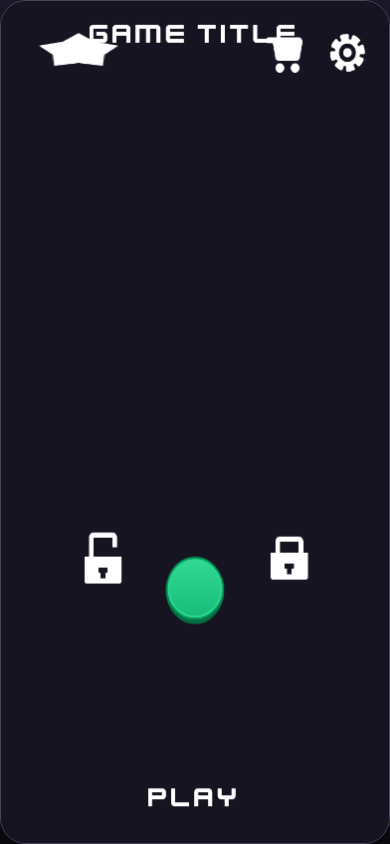
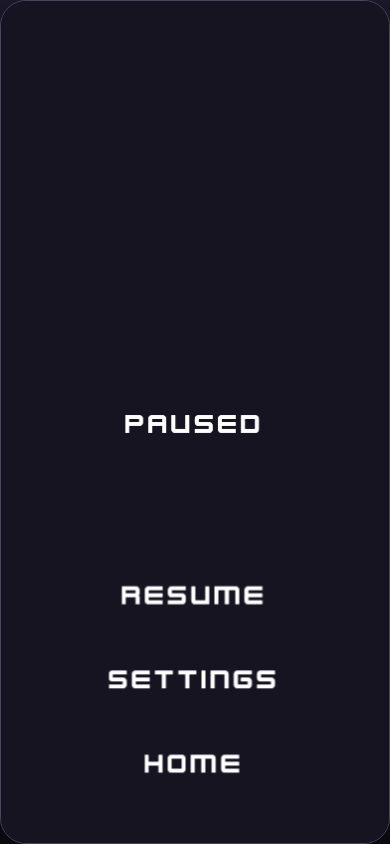
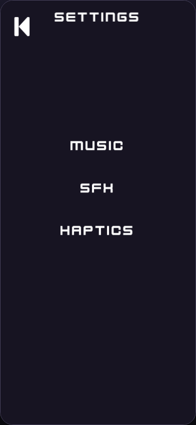
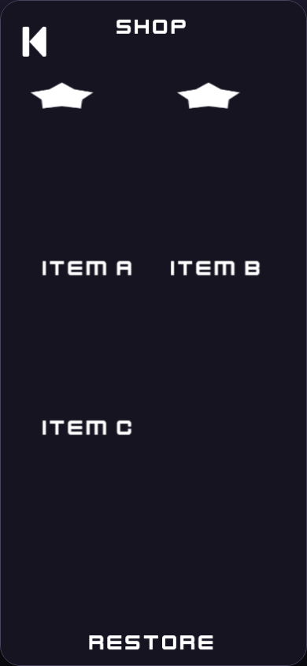
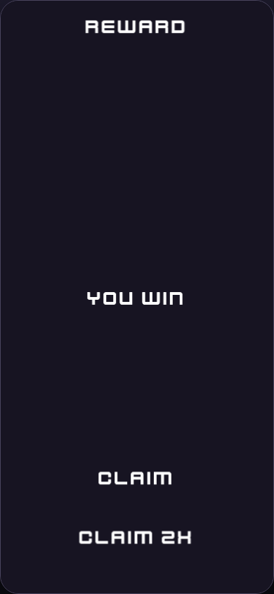
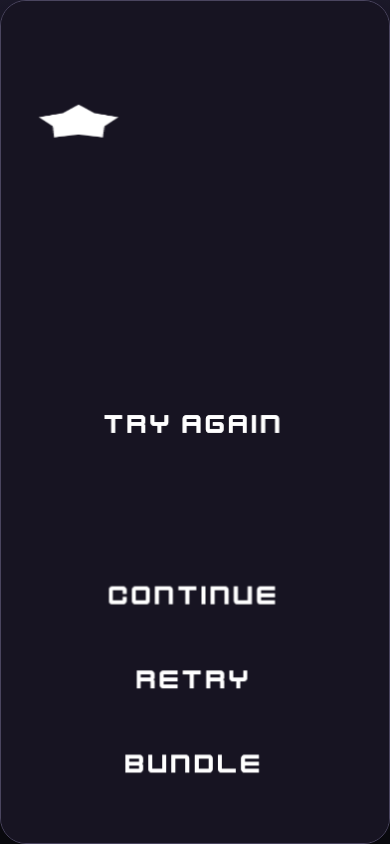
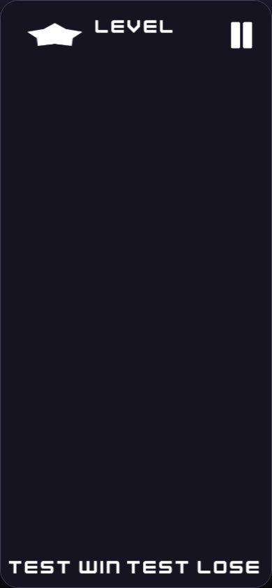

# U5 Phaser Visual-Parity Journal

This journal is append-only. It records the screenshot-driven repair that turns the correct Phaser semantic spine into a fair, testable counterpart to the accepted Grapes P0.

## Baseline Mobile UI/UX Audit

First 30 seconds: 2/5 - Play exists, but the sparse canvas does not communicate a finished shell or the progression path clearly.
Touch ergonomics: 1/5 - Action labels have no visible 44-pixel-or-larger control surfaces.
HUD readability: 3/5 - Currency, level, and pause carriers are present, but counters lack values and visual grouping.
Gameplay focus: 3/5 - The central region is uncluttered, but it is also unbounded and visually unexplained.
Feedback: 1/5 - Static text provides no pressed, toggle, modal, or result-state affordance.
Flow momentum: 2/5 - Win/Fail actions exist, but missing costs, outcomes, and hierarchy make the next tap ambiguous.
Responsive canvas: 4/5 - The 390 x 844 portrait contract and scale mode are proven; safe-area composition still needs device confirmation.
Evidence: 2/5 - Seven phone-sized baseline captures exist; post-repair behavior and real-device proof are still pending.

Priority fixes:

1. Restore visible, reachable action surfaces and the Menu/Win/Fail flow hierarchy.
2. Compose each empty container into a recognizable shell surface while preserving semantic authority.
3. Prove every state in Chromium and on the paired phone, then run the independent aesthetics gate.

## Task V1 - Recompose the Menu Dock

### Task Snapshot

Status: active

The current Menu scene contains every required semantic carrier, but it renders as a dark labelled wireframe. Shop and Settings float at the top, Play is bare text, and the hero and navigation containers are visually empty. This task composes those same carriers into the intended mobile shell without changing their identities.

### Task Acceptance Criteria

- Shop, Play, and Settings form one lower dock, with Play visually primary.
- Hero and progression areas have visible composition surfaces.
- All existing menu semantic IDs remain present exactly once.

### Iteration 1 - Frozen Wireframe Baseline

#### Planned Result

Replace the sparse menu presentation with an Editor-generated light shell while keeping the semantic contract unchanged.

#### Why This Iteration

The first iteration freezes the honest pre-change state before the real-Editor visual recipe is applied.

#### Capture Setup

- Route: temporary immutable publication review server
- Viewport: 390 x 844 CSS pixels
- Fixture: pre-repair P0 publication `sha256-5e10af032311a366cc500c1d4f08ece51a1c2ebbd99e119ea0f9eb1a8735f83b`
- State: `menu`

#### Pre-Change Screenshots

What to look at: The top-right Shop and Settings icons and the bare Play label at the bottom.
Observation: The semantic objects exist, but there is no lower three-button dock, hero card, or primary button surface.
Acceptance check: Dock criterion fail; composed-surface criterion fail; semantic-id preservation is already met.

#### Changes Made

Pending real-Editor visual-seed application.

#### Post-Change Screenshots

Pending.

#### Decision

partial

#### Next Action

Apply the deterministic visual recipe through Phaser Editor, regenerate, and recapture Menu at the same viewport.

#### Spawned Tasks

- Per-instance surface asset identity remains a U7 contract question; visual companions are sufficient for this comparison and do not change semantic authority.

## Task V2 - Distinguish Pause and Settings

### Task Snapshot

Status: active

Pause and Settings are semantically distinct but currently share the same sparse-text silhouette. This task adds the missing modal/page composition so the distinction is visible rather than merely encoded.

### Task Acceptance Criteria

- Pause has a scrim, modal card, and surfaced Resume/Settings/Home actions.
- Settings has a page surface, back action, and three visible on-state switches.
- The two silhouettes are visibly distinct at a glance.

### Iteration 1 - Frozen Wireframe Baseline

#### Planned Result

Create a centered Pause modal and a separate full-page Settings composition.

#### Why This Iteration

The baseline proves the user-reported sameness before the repair.

#### Capture Setup

- Route: temporary immutable publication review server
- Viewport: 390 x 844 CSS pixels
- Fixture: pre-repair P0 publication
- State: `pause`, `settings`

#### Pre-Change Screenshots

What to look at: The uncontained Paused title and bare action labels.
Observation: No scrim, dialog card, or button surfaces communicate a temporary modal.
Acceptance check: Pause criterion fail; distinct-silhouette criterion fail.

What to look at: The three plain Music, SFX, and Haptics labels.
Observation: No page surface or switches make the labels read as settings controls.
Acceptance check: Settings criterion fail; distinct-silhouette criterion fail.

#### Changes Made

Pending real-Editor visual-seed application.

#### Post-Change Screenshots

Pending.

#### Decision

partial

#### Next Action

Apply the modal/page recipes and compare both states side by side.

## Task V3 - Compose the Shop

### Task Snapshot

Status: active

Shop contains the required back action, two counters, item identities, and Restore action, but its containers and cards are invisible. The repair should remain a structural placeholder and avoid implying finalized commerce.

### Task Acceptance Criteria

- Page, grid, and three item cards are visibly surfaced.
- Both counters and the back action are legible.
- Restore has a secondary-action surface.

### Iteration 1 - Frozen Wireframe Baseline

#### Planned Result

Create a restrained shop page with visible item cards and Restore control.

#### Why This Iteration

The baseline separates a missing visual hierarchy from intentionally deferred shop product design.

#### Capture Setup

- Route: temporary immutable publication review server
- Viewport: 390 x 844 CSS pixels
- Fixture: pre-repair P0 publication
- State: `shop`

#### Pre-Change Screenshots

What to look at: Item labels floating directly on the dark canvas.
Observation: The page, grid, item cards, and Restore surface are absent.
Acceptance check: All three criteria fail.

#### Changes Made

Pending real-Editor visual-seed application.

#### Post-Change Screenshots

Pending.

#### Decision

partial

#### Next Action

Apply the shop companion surfaces and recapture the page.

## Task V4 - Repair Win and Fail Action Hierarchy

### Task Snapshot

Status: active

Win and Fail currently expose placeholder labels without result panels, action surfaces, reward-ad wording, coin cost, or bundle outcome. This task restores the approved flow facts and makes each choice visually explicit.

### Task Acceptance Criteria

- Both states have a clear result card and surfaced action hierarchy.
- Win shows `5 Coins earned` and `Claim 2x · Watch ad`.
- Fail shows `25 Coins`, `Continue · 10 Coins`, and `Rescue bundle · $4.99 · Continue this level`.
- Hidden Win Next/Home semantics remain hidden in P0.

### Iteration 1 - Frozen Wireframe Baseline

#### Planned Result

Compose two result modals and restore all accepted reward/cost copy.

#### Why This Iteration

These are the most consequential shell facts and must be testable without reading source code.

#### Capture Setup

- Route: temporary immutable publication review server
- Viewport: 390 x 844 CSS pixels
- Fixture: pre-repair P0 publication
- State: `win`, `fail`

#### Pre-Change Screenshots

What to look at: The bare Reward, Claim, and Claim 2x strings.
Observation: No card or buttons are visible, and the earned amount and watch-ad affordance are missing.
Acceptance check: Result-card fail; Win-copy fail; hidden-state criterion met.

What to look at: Continue, Retry, and Bundle as unstyled labels.
Observation: The coin balance, continuation cost, bundle price, and bundle outcome are absent.
Acceptance check: Result-card fail; Fail-copy fail.

#### Changes Made

Pending real-Editor visual-seed application.

#### Post-Change Screenshots

Pending.

#### Decision

partial

#### Next Action

Apply the modal, action-surface, and fact-copy recipe, then recapture both outcomes.

## Task V5 - Complete the Level Shell

### Task Snapshot

Status: active

Level has the correct HUD and mechanics mount semantics, but its gameplay container and diagnostic actions are visually empty. The shell should bound the mechanics-owned region without implementing a mechanic.

### Task Acceptance Criteria

- Gameplay region is visibly bounded and labeled.
- Currency, level label, and pause remain a clear HUD.
- Test Win and Test Lose have distinct surfaced controls.

### Iteration 1 - Frozen Wireframe Baseline

#### Planned Result

Add a clear gameplay placeholder and surfaced diagnostic controls.

#### Why This Iteration

The baseline proves that the mechanic remains intentionally absent while the shell composition is incomplete.

#### Capture Setup

- Route: temporary immutable publication review server
- Viewport: 390 x 844 CSS pixels
- Fixture: pre-repair P0 publication
- State: `level`

#### Pre-Change Screenshots

What to look at: The empty central canvas and edge-aligned Test Win/Test Lose labels.
Observation: The mechanics mount has no visible boundary and the diagnostic actions have no surfaces.
Acceptance check: Gameplay-region fail; HUD met; diagnostic-action criterion fail.

#### Changes Made

Pending real-Editor visual-seed application.

#### Post-Change Screenshots

Pending.

#### Decision

partial

#### Next Action

Apply the level companion recipe and recapture the state.

## Task V6 - Prove the Authoring UX

### Task Snapshot

Status: active

The Editor can compile the seven scenes and the current live-copy plugin previews any text textarea, but the curated metadata is not surfaced and locked fact copy is not protected. This task closes both authoring UX seams without creating a new authority.

### Task Acceptance Criteria

- Catalog UI visibly surfaces all 24 entries and required R9 metadata.
- Live preview accepts only proven editable semantic Text carriers.
- Locked facts, nonsemantic text, and metadata fields are excluded.

### Iteration 1 - Pre-Change Audit

#### Planned Result

Add a read-only catalog panel and a fail-closed live-copy eligibility check.

#### Why This Iteration

The authoring approach cannot be fairly tested if its asset information is hidden or its code-owned facts can drift through the preview seam.

#### Capture Setup

- Route: loopback-only Phaser Editor over SSH forwarding
- Viewport: 1600 x 1000
- Fixture: clean P0 scratch
- State: Menu scene and Inspector

#### Pre-Change Screenshots

No stable pre-change screenshot exists; the repository audit found no catalog panel implementation.
What to look at: The absence itself is proven by the plugin inventory and will be contrasted with the post-change Editor capture.
Observation: Only `live-copy-preview` exists, and it accepts every enabled `textarea.formText`.
Acceptance check: Catalog criterion fail; restricted-copy criterion fail.

#### Changes Made

Pending plugin implementation and real-Editor load proof.

#### Post-Change Screenshots

Pending.

#### Decision

partial

#### Next Action

Load the updated allowlisted plugins in a fresh Editor scratch and capture their probes and UI.
