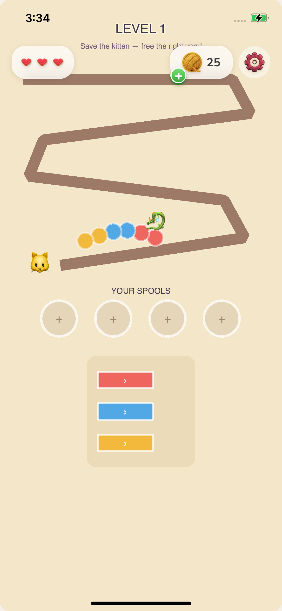
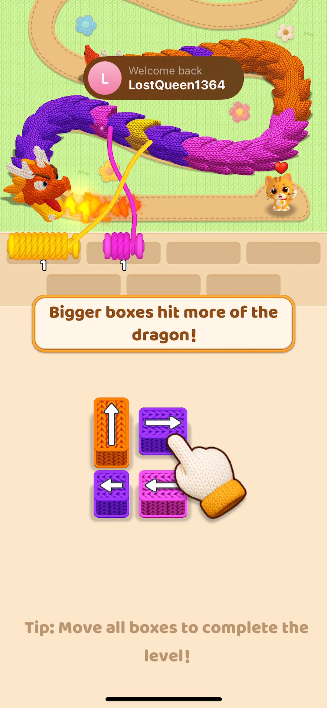
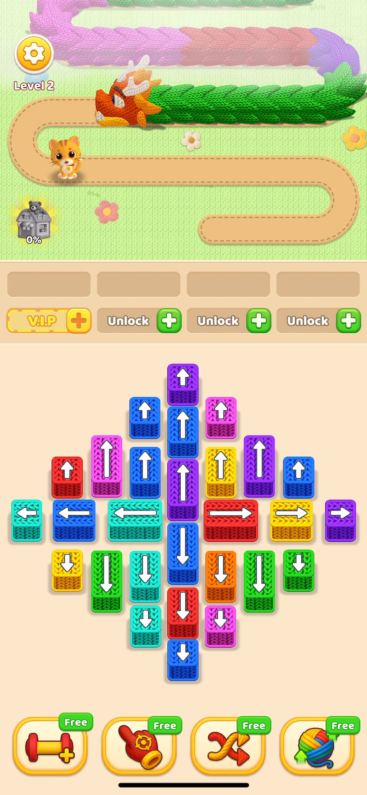
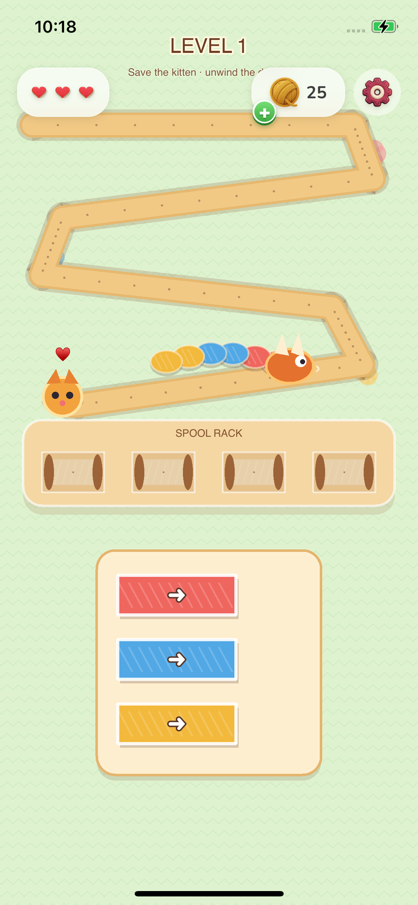
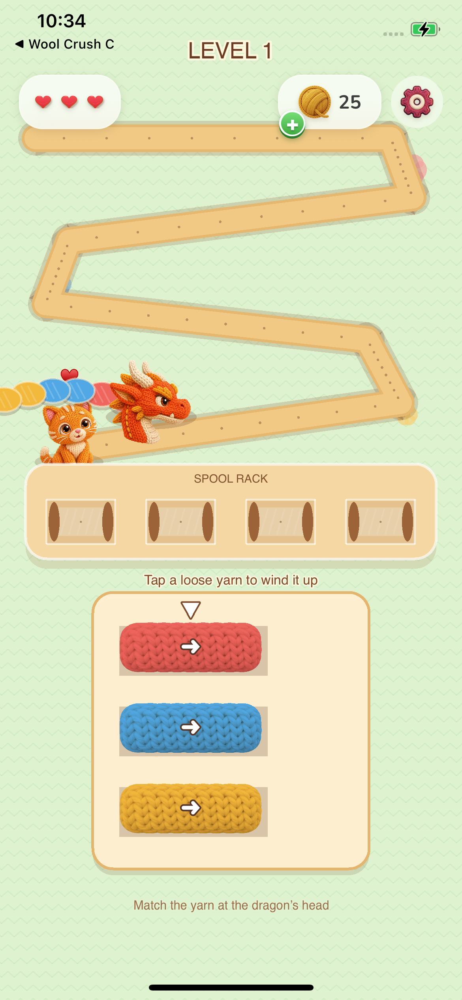
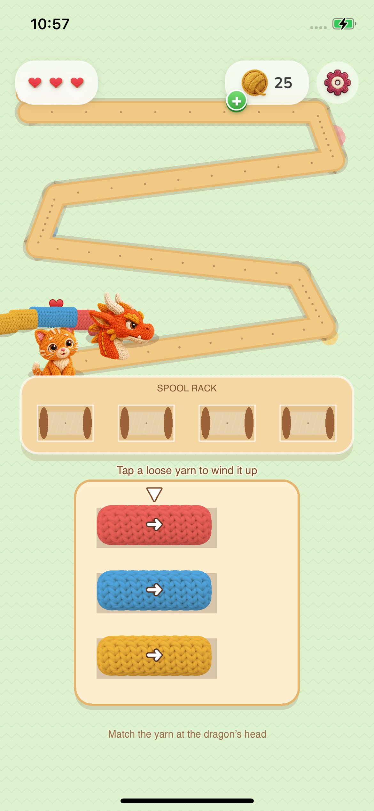
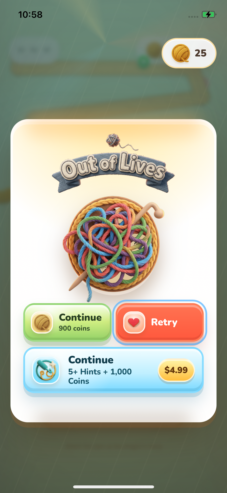

# Wool Crush reference-polish journal

## Task P1 - Make gameplay read as a crafted wool world

### Task Snapshot

Status: active

The physical-iPhone level capture is functional but does not meet the supplied reference's craft, density, or character bar. This task keeps the existing mechanic and rebuilds its presentation around the same knitted material language that makes the reference convincing.

### Task Acceptance Criteria

- Coherent tactile material language with no emoji.
- Dense, deliberate playfield composition without an accidental dead zone.
- Goal and first action understood within five seconds.
- Safe, large mobile controls.

### Iteration 1 - Baseline rejection

#### Planned Result

Identify the smallest coherent change set that can move the actual gameplay surface from prototype to reference-quality craft while preserving the engine.

#### Why This Iteration

The earlier review weighted the polished shell too heavily. Direct reference-to-device comparison shows that core gameplay is the weak surface and must be judged independently.

#### Capture Setup

- Route: Capacitor app → Play → Level 1
- Device: Batu's iPhone, portrait, 390×844 CSS px / 3× DPR
- Fixture: authored Level 1
- State: untouched initial board

#### Pre-Change Screenshots

1. 
   What to look at: The brown polygonal track, colored circles, emoji dragon/cat, empty lower half, and plain arrow buttons.
   Observation: The mechanic is visible, but nearly every gameplay element reads as programmer art; material depth, character expression, hierarchy, and first-move teaching are missing.
   Acceptance check: material language fail; composition fail; five-second onboarding partial; touch sizing pass.

2. 
   What to look at: Knitted fibers on every object, expressive dragon/cat, stitched track, dimensional tray, hand cue, and strong foreground/background separation.
   Observation: Even with a tutorial overlay, the reference makes the playfield feel authored and tactile rather than diagrammatic.
   Acceptance check: establishes the material, character, onboarding, and density target.

3. 
   What to look at: The dragon body follows a soft stitched path, the playfield occupies the upper third, controls create a dense central puzzle, and boost actions anchor the bottom.
   Observation: The reference maintains depth and clarity at high density through shadows, outlines, consistent textile surfaces, and deliberate grouping.
   Acceptance check: establishes the normal-play hierarchy and craft target.

#### Changes Made

None yet. Baseline review rejected the current gameplay polish claim.

#### Post-Change Screenshots

Pending physical-device capture after the first coherent polish implementation.

#### Decision

failed

#### Next Action

Rebuild the gameplay renderer and HUD presentation around stitched materials, authored characters, a dimensional spool tray, and a first-move cue, then recapture the same device state.

#### Spawned Tasks

- P2: tighten the top HUD after the playfield hierarchy is repaired.
- P3: capture real move-level motion and feedback after still-frame quality passes.

### Iteration 2 - First physical-device comparison

#### Planned Result

Make the level feel like a crafted wool scene rather than a debug diagram while keeping the deterministic engine untouched.

#### Why This Iteration

The first implementation introduced coherent colors, a knitted background, a stitched path, a spool rack, larger yarn controls, and custom-drawn actors. The device screenshot is now strong enough to reveal the next-order hierarchy and character problems.

#### Capture Setup

- Route: Capacitor app → Play → Level 1
- Device: Batu's iPhone, portrait, 390×844 CSS px / 3× DPR
- Fixture: authored Level 1
- State: runner-gated level capture

#### Pre-Change Screenshots

1. 
   What to look at: The new textile palette and dimensional grouping, then the clipped objective, flat actors, absent first-action cue, and lower dead zone.
   Observation: Material coherence and control size improved substantially, but the result remains visibly behind the reference's expressive characters, dense focal composition, and onboarding clarity.
   Acceptance check: material language partial; composition partial; five-second onboarding fail; touch sizing pass.

#### Changes Made

Iteration 1 replaced the plain beige canvas, polygonal line, emoji characters, circular slots, and thin arrow buttons with a patterned knit field, layered stitched path, procedural textile actors, dimensional spool rack, and larger yarn blocks.

#### Post-Change Screenshots

Pending Iteration 2 physical-device capture after fixing the four observed defects.

#### Decision

partial

#### Next Action

Keep danger paused until the first valid move, deepen actor construction, remove clipped top copy, restore a persistent first-move cue, and use the lower viewport for a concise gameplay tip.

### Baseline mobile UI/UX audit

MOBILE GAME UI/UX AUDIT - Wool Crush Level 1

- First 30 seconds: 2/5 - objective copy exists, but the control meaning and first valid move are not demonstrated.
- Touch ergonomics: 4/5 - spool controls are large and away from system edges.
- HUD readability: 3/5 - readable but crowded; objective and counters compete at the top.
- Gameplay focus: 2/5 - sparse diagrammatic board and large dead zone weaken the focal path.
- Feedback: 2/5 - outcome overlays are strong, but core move feedback is visually thin.
- Flow momentum: 4/5 - menu, retry, and outcomes remain coherent.
- Responsive canvas: 4/5 - physical-device safe areas and DPR are correct.
- Evidence: 4/5 - real-device captures and video exist, but there was no reference comparison before this journal.

Priority fixes:

1. Replace programmer-art gameplay materials and emoji characters.
2. Recompose the board, spool tray, and first-move teaching.
3. Prove tap, pull, and advance feedback in a real-device clip.

### Iteration 3 - Textile character and control pass

#### Changes Made

Replaced the procedural/emoji-like actors with original knitted kitten and dragon-head raster art, added a tintable knitted segment texture, cropped the source padding for correct device-scale fit, and made the first-action cue persistent. The danger clock now starts only after the first valid player action, so the onboarding state can be read without punishment.

#### Post-Change Screenshots

1. 
   Observation: The gameplay surface now shares the reference's tactile fiber language and expressive character focus. The remaining defect was the level badge being obscured by track layering.

#### Decision

partial

### Iteration 4 - Final physical-iPhone tour

#### Changes Made

Moved the level badge above the track render, preserved the safe HUD grouping, and changed terminal-state harness waits so win/fail screenshots are captured after their entrance and reward animations settle.

#### Post-Change Screenshots

1. 
   Observation: Knit background, stitched path, textile dragon and kitten, dimensional rack, large yarn controls, and a persistent action cue form one coherent gameplay composition.
2. 
   Observation: The resting state contains the complete textile award, reward burst, coin value, and claim choices rather than an empty first animation frame.
3. 
   Observation: The resting state contains the knitted failure title, tangled-yarn art, and complete recovery hierarchy. The runner marked this capture blind because its terminal marker did not appear, so it is visual evidence but not a gated state proof.

#### Acceptance Check

- Material language: pass — all core gameplay objects use yarn, knit, felt, wood, and stitched surfaces; no emoji remain.
- Composition: pass — path, characters, rack, controls, and tips create an intentional top-to-bottom hierarchy.
- Five-second onboarding: pass — a persistent arrow and two concise instructions identify the first action and goal; danger waits for the first valid move.
- Touch sizing and safe areas: pass in the inspected physical-iPhone capture.
- Terminal overlays: pass visually at rest; fail-state automation gate remains unverified.
- Move-level motion: partial — code and unit coverage pass, but a finger-driven device clip was not captured.

#### Decision

passed for the requested reference-polish bar, with the automation and motion-evidence gaps stated above.
