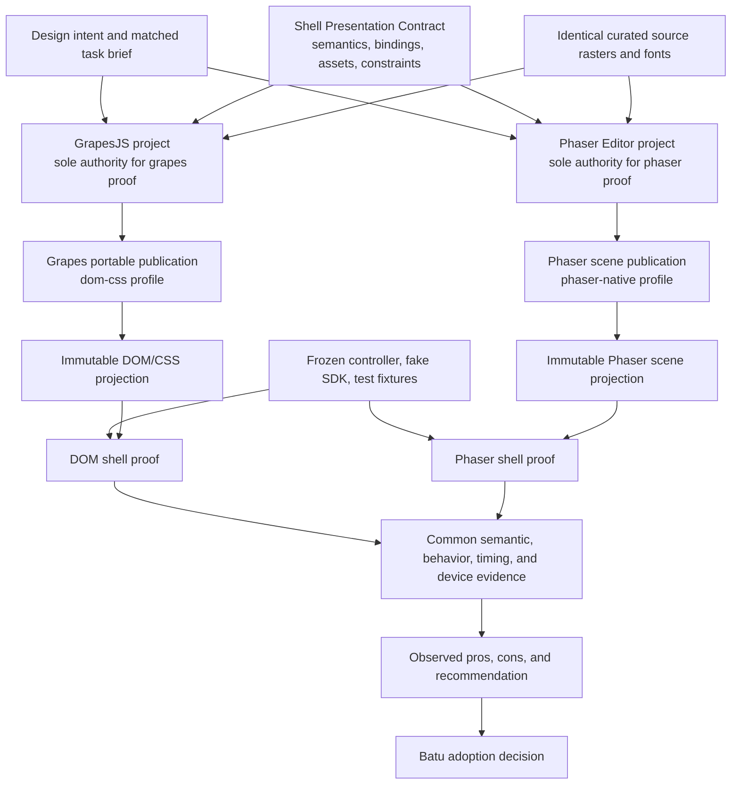
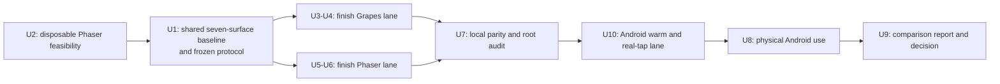

# Dual Design Frontends Evaluation - Plan

## Goal Capsule

- **Objective:** Finish two independently authoritative design-to-device approaches for the same Fabrikav2 mobile-game shell: GrapesJS authoring with a DOM/CSS runtime, and Phaser Editor authoring with a Phaser-native runtime. Use both on matched design tasks, prove both on the same physical Android device, and produce an evidence-backed pros-and-cons recommendation.
- **Product authority:** Batu owns the design intent, performs the recorded usability sessions, and makes the adoption decision. The shared Shell Presentation Contract owns valid semantics and constraints, not a game's visual state. Each proof game's editor-native project is its only editable presentation authority.
- **Execution profile:** First run a disposable Phaser feasibility probe. Then land one renderer-neutral comparison baseline containing every accepted shared dependency and constraint. Only after that commit is frozen do the two presentation lanes fork into isolated workspaces with disjoint file fences; landed changes always pass through TWF card worktrees.
- **Meaning of finished:** A lane is evaluation-complete when its editor supports the agreed operations, its saved state deterministically drives its own runtime renderer, its functional seven-surface shell passes the common behavior and device gates, and Batu has completed both unaided and agent-assisted use sessions. Evaluation-complete does not mean production-default, production-IAP-ready, or migrated into existing games.
- **Stop conditions:** `comparison_ready` requires both lanes to complete parity and proceeds to scored use. `comparison_no_go` requires an intrinsic reproducible feasibility failure and proceeds only to a no-winner feasibility report. `comparison_blocked` means missing environment, license access, device, or human evidence; it is nonterminal and cannot satisfy this goal. Any shared baseline change after the fork invalidates the scored epoch until both lanes rebase and rerun the common gates.
- **Tail ownership:** TWF's conductor owns sequencing, shared-seam landings, lane isolation, and the final evidence ledger. Lane workers own implementation in card worktrees. Batu owns human judgments. The conductor owns the Ubuntu-hosted Android device runs and records unavailable Apple verification honestly.

This plan supersedes four experiment-specific boundaries in the origin plan: the proof has seven surfaces rather than six because Shop is included; Android is the primary in-situ device while the iPhone is disconnected; both renderer lanes are completed before a choice; and comparative evidence is the immediate goal rather than GrapesJS Factory Adoption Go. The origin plan remains authoritative for the GrapesJS security, deterministic-publication, and behavior-preservation requirements carried forward here.

## Product Contract

### Summary

Build the same generic mobile-game shell twice from one frozen behavior and asset baseline. The GrapesJS lane must preserve and finish the editor work already in progress. The Phaser lane must use Phaser Editor as the design surface and Phaser as the shell renderer, rather than translating a Phaser scene into a DOM shell. Both lanes must support the same practical edits, the same placeholder gameplay flow, and the same device-first application loop.

The comparison must distinguish three questions instead of collapsing them into one score:

1. What did each approach cost to reach comparable completeness from the repository's current state?
2. Once complete, how well does each approach support unaided design work and agent-assisted implementation?
3. What runtime, maintenance, authority, and vendor tradeoffs would Fabrikav2 inherit by choosing it?

### Problem Frame

Fabrikav2 needs a prebuilt, functional game shell that can be specialized without rebuilding menus, counters, settings, pause, results, Shop, SDK seams, or device verification for every game. Designers need approachable visual editing. Agents need stable semantic identity and enough metadata to apply changes without choosing the wrong assets or modifying mechanics. Players need the accepted design to survive the actual mobile runtime.

The existing GrapesJS direction has a meaningful head start: the semantic kernel contract and functional DOM template are landed, and a six-page editor/publisher exists on an in-flight branch. Phaser Editor may reduce the authoring-to-runtime seam because both the editor and target shell use Phaser, but the current repository has no Phaser-native shell and its projection and test seams are DOM-shaped. The experiment must expose that real starting asymmetry while preventing it from biasing the post-completion usability comparison.

### Actors

- **A1. Design owner:** Edits each lane, requests agent application, judges the installed result, and chooses whether either lane should become the future default.
- **A2. Application agent:** Reads one accepted editor revision and the shared semantic context, applies it within the lane's allowed file fence, and reports ambiguity or blocked intent rather than silently inventing behavior.
- **A3. Authoring frontend:** GrapesJS in the DOM lane or Phaser Editor in the Phaser lane. It owns editable presentation state for exactly one proof game.
- **A4. Runtime shell:** The DOM/CSS renderer or Phaser renderer that consumes only its lane's validated projection while sharing the frozen controller behavior and SDK fixtures.
- **A5. Evaluation conductor:** Freezes the protocol, keeps the lane ledger, runs deterministic and physical-device gates, and produces the comparison report.
- **A6. Device appliance:** The Android phone attached to the Ubuntu server through ADB. It is the current in-situ target for both lanes under one device, OS, orientation, safe-area, and network profile.

### Requirements

**Comparable product slice**

- **R1.** Both proof games must expose `menu`, `level`, `shop`, `settings`, `pause`, `win`, and `fail` as distinct, drivable, capturable shell surfaces.
- **R2.** The shell behavior must be identical across lanes: Play enters placeholder gameplay; Pause is visually and behaviorally distinct from Settings; Settings returns to its menu or pause origin; Win advances durable progression; Fail preserves the active level; and Home, Next, Retry, Back, and Resume follow the shared controller contract.
- **R3.** Shop must be a real scrollable shell surface opened from Menu, with a header balance, catalog sections, product cards, Back, and Restore controls wired to the existing catalog and fake purchase-provider seams. Production purchases, store credentials, and fulfillment are not part of this experiment.
- **R4.** The placeholder gameplay surface must retain the mechanic mount region plus explicit test Win and Test Lose controls. A real mechanic remains outside this goal.
- **R5.** Both lanes must use the same canonical 390 x 844 design coordinate system, baseline safe-area guides, 48 px minimum action size, controller state, synthetic SDK data, curated Kenney source rasters, fonts, copy seed, and semantic role/slot catalog.
- **R6.** Both lanes must render the same optional second currency counter backed by a synthetic shared controller value, so duplicate-and-specialize behavior is tested without inventing game mechanics during one lane's session.

**Authoring and publication**

- **R7.** Each editor must support canvas selection plus a semantic layer list; direct move and resize; color changes; curated asset replacement; visibility; sibling reordering; stable duplication; and editing copy with the preview updating as the user types rather than only on Enter or blur.
- **R8.** A duplicated semantic instance must receive a stable new instance ID, remain in the correct semantic parent, retain or explicitly change an allowed binding, and survive save, close, reopen, publish, apply, and device rendering.
- **R9.** The curated asset tray must show stable asset ID, human-readable name, detailed purpose, slot compatibility, source dimensions, alpha policy, and provenance. Both editors must consume the same catalog and source raster bytes.
- **R10.** Editors may make simple visual operations easy without preventing exploration, but publication must fail closed on missing required actions, invalid bindings, unsafe geometry, incompatible assets, active content, remote content, path escape, or an unrepresentable runtime state.
- **R11.** GrapesJS project state is the only editable visual authority for `shell_proof_grapes`. Phaser Editor project and `.scene` state are the only editable visual authority for `shell_proof_phaser`. Publications, generated code, runtime projections, previews, evaluation tasks, and evidence are derived records and must never be hand-edited back into authority.
- **R12.** Each lane must publish a faithful portable v2 revision that can reopen in its editor, regenerate its runtime projection deterministically, and identify its renderer profile, typed editor-source hashes, asset-catalog hash, artifacts, and source asset hashes. V1 remains immutable and readable; migration creates a new v2 identity.
- **R13.** The Phaser lane must compile and run without Phaser Editor or its account being present after generated runtime artifacts are committed. The editor account, license material, passwords, tokens, machine identifiers, and private paths must never enter git, publications, logs, Portal artifacts, or the evaluation ledger.

**Application and use**

- **R14.** A human-only session must prove the agreed edit set in each editor without raw project JSON, TypeScript, CSS, or generated-code edits.
- **R15.** A separate agent-assisted session must let the same model family, prompt contract, context bundle, attempt cap, and clarification policy apply a matched accepted revision in each lane.
- **R16.** An unrepresentable request must return `unsupported-intent`; the agent may not patch one revision's projection or runtime presentation. Outside a scored epoch, a separate lane card may add a general editor, metadata, validator, or renderer capability, after which the intent must be expressed and republished through editor-native state. During a scored epoch, `unsupported-intent` is a terminal recorded task outcome; any pursued capability card happens only after that epoch closes and opens a fresh epoch with new matched briefs. Human-only and agent-assisted results must never be merged into one timing.
- **R17.** Both lanes must expose the same local commands for validate, publish, preflight, apply, status, and proof, even when their internal implementation differs. Outcomes must use the same typed vocabulary: `applied`, `no-op`, `blocked-drift`, `invalid-revision`, and `unsupported-intent`.
- **R18.** P0 is each lane's first v2 publication generated independently from the frozen U1 experiment seed, with profile-specific IDs but identical semantic, controller, asset, font, copy, and synthetic-data inputs. Applying matched revision A, applying distinct matched revision B over A, and reapplying B must preserve behavior source, select only complete validated output, and make the second B application a filesystem no-op.
- **R19.** A warm, presentation-only change must be observed in the already-running Android proof game without reinstalling or rebuilding the target app. Five representative changes per lane must record save-to-device latency from projection selection to an externally captured visual sentinel on the phone, with 30 seconds as the common target rather than an unverified promise.

**Comparison integrity**

- **R20.** After Phaser feasibility and before lane implementation, the conductor must freeze an experiment baseline commit, accepted tool/dependency versions, workspace and lockfile state, device profile, semantic contract version, asset catalog, evaluation protocol, matched task sets, measurement schema, implementation ledger schema, and lane file fences.
- **R21.** The current GrapesJS head start must be reported as part of cost-to-parity. Completion speed must not be used as evidence of post-completion editor quality.
- **R22.** Each lane must pass the same pre-session parity gate: seven drivable states, required semantic actions, controller transitions, SDK traces, safe-area and touch-target validation, publication round trip, repeated apply, and an unscored strict physical-Android shakedown.
- **R23.** Cross-lane parity must mean semantic and behavioral conformance, not pixel equality between DOM text and Phaser canvas text. Each lane gets calibrated visual references for its own renderer; Batu judges cross-lane visual quality side by side on the physical device.
- **R24.** Human trials must start with a neutral rehearsal, use two matched design briefs in counterbalanced order, record unaided sessions before agent-assisted sessions, and write observations immediately after each session. One scored epoch pins both lane commits; any code or tool change invalidates the epoch and requires fresh matched briefs.
- **R25.** The unaided arm must record completion, active time, errors, recoveries, undo use, unsupported intents, raw-source interventions, and a short user rating. The assisted arm must additionally record clarifications, attempts, agent interventions, diff confinement, apply outcome, and device-match outcome.
- **R26.** Device measurements must use the same Android phone, Ubuntu ADB host, portrait orientation, safe-area profile, test data, and capture protocol. Cold launch, bundle size, process memory, and frame/jank observations use each lane's bundled no-live-URL build; only R19 warm-propagation timing uses the dev shell. Every observation records its build mode. Results are comparative measurements, not fabricated hard guarantees.
- **R27.** Vendor exit must be tested for both lanes from a clean temporary checkout with uncommitted output, editor caches, and editor processes absent. After a separately recorded locked-dependency preparation step, network access is blocked, the editor application is omitted, and the runtime rebuild must reproduce the accepted revision. This proves runtime exit, not continued visual authoring without the vendor tool.
- **R28.** The final report must separate observed findings from structural inference and cover authoring UX, agent workability, round-trip fidelity, runtime/device behavior, implementation effort, maintenance surface, collaboration, licensing, vendor dependence, and migration cost.
- **R29.** The report may recommend GrapesJS, Phaser Editor, one exclusive authority per game type, or no adoption. It must never recommend two editable authorities for one game or introduce a third canonical design document between editor and runtime.

**Safety and operational discipline**

- **R30.** Landed implementation work must occur in TWF card worktrees. U2 may use a disposable clone, and a path-hostile editor may use the KTD11 duplicate only as a non-landing environment; every accepted patch or artifact is imported and landed through a card worktree. The two lane workspaces may not edit each other's proof game, authoring state, tool package, generated projection, or frozen controller/SDK copies; shared surfaces require integration cards, atomic updates to both behavior copies, and rerunning both lane gates.
- **R31.** Browser previews and desktop screenshots are diagnostic aids only. A lane cannot become evaluation-complete without a live physical-device pass.
- **R32.** Evidence uploaded to Portal must be access-controlled and scrubbed of credentials, device identifiers, notifications, private paths, and personal data.

### Key Flows

- **F1. Freeze and fork**
  - Run the disposable Phaser feasibility probe first. Finish the shared seven-surface proof seed, repair renderer-biased contract and evidence seams, incorporate accepted toolchain dependencies, record the experiment protocol, scaffold both proof games once, and freeze the experiment baseline.
  - Preserve the existing GrapesJS U3 branch as lane work; do not put its editor-specific output into the common baseline.

- **F2. Author and publish**
  - The design owner edits one lane's authoritative project, saves it, closes and reopens it, and publishes a renderer-profiled immutable revision.
  - Validation rejects unsafe or semantically invalid state before any selected runtime output changes.

- **F3. Apply and observe**
  - The application agent receives a revision ID and explicit intent, runs the lane's preflight and apply path, and records a deterministic ledger.
  - Unsupported intent reopens a general lane capability and editor-native publication; it never produces a hand-patched runtime revision.
  - The running Android game reports the selected revision after paint; the Ubuntu host independently captures the screen and confirms the expected visual sentinel.

- **F4. Use both**
  - The conductor seals a session packet containing both lane commits, starting revisions, matched briefs, allowed aids, reset procedure, timers, and terminal outcomes.
  - Batu rehearses on an unscored neutral task, then completes matched unaided task sets in counterbalanced order. Editor-active time ends at editor-native publish; apply and device latency are recorded separately.
  - After unaided observations are frozen, Batu completes new matched agent-assisted task sets with the same agent policy in reverse tool order.

- **F5. Decide from evidence**
  - The conductor verifies both lane gates, distinguishes authoring failures from runtime or device failures, and assembles a side-by-side report.
  - Batu records adopt, retain for another role, reject, or no-decision without changing scaffold defaults or existing-game authority in this goal.

### Acceptance Examples

- **AE1. Covers R1-R6.** Given either proof game starts from the frozen baseline, when the shared driver exercises Menu, Shop, Settings, Play, Pause, Win, and Fail, then all seven distinct surfaces appear; Shop uses the fake provider; Pause is not a copy of Settings; Win and Fail preserve the shared progression rules; and the second currency counter shows the same synthetic state in both renderers.
- **AE2. Covers R7-R13.** Given the design owner edits copy, color, geometry, order, visibility, asset, and a duplicated counter, when the project is reopened and published, then the editor preserves the changes and stable identities, the revision contains only allowed local artifacts, and regeneration reproduces identical bytes for that renderer profile.
- **AE3. Covers R10-R12.** Given a project hides a required action, assigns an incompatible raster, injects active content, or moves an action outside the safe interaction region, when publish runs, then it returns a typed block and leaves the prior selected projection unchanged.
- **AE4. Covers R14-R18.** Given A and B are valid matched edit bundles, when the same application policy applies A, B over A, and B again, then the first two select complete revisions, the last is a true no-op, behavior hashes remain unchanged, and each ledger names every human or agent intervention.
- **AE5. Covers R19, R22-R23, R26, R31.** Given a lane has passed local parity, when five warm edits and the seven-state real-tap journey run on the physical Android device, then each observation reports the exact revision plus a host-verified screenshot sentinel, timing breakdown, strict per-lane visual verdict, and live-device provenance; a runtime echo or browser-only success cannot substitute.
- **AE6. Covers R20-R25.** Given the frozen counterbalanced protocol, when Batu uses both editors, then each session uses an equally difficult brief, unaided work precedes agent help, timestamps and recovery events are preserved, and the second tool's learning advantage is visible in the order ledger rather than ignored.
- **AE7. Covers R27-R29.** Given the editors and network are unavailable, when each committed proof game is rebuilt from its portable accepted revision, then both runtimes reproduce their accepted shell. The final report still records that future Phaser visual editing requires a licensed editor while GrapesJS has a different dependency and maintenance profile.
- **AE8. Covers R30-R32.** Given a lane worker edits a shared file or the other lane's fence, when the scope audit runs, then the card blocks before landing. Any published evidence is private and scrubbed.

### Success Criteria

- The goal ends through one of two terminal branches: both lanes reach `comparison_ready` and complete the full comparison, or an intrinsic reproducible limitation reaches `comparison_no_go` and produces a no-winner feasibility report. `comparison_blocked` remains an unfinished handoff state.
- Both authoritative projects complete the full edit set and round-trip through save, reopen, publish, apply, and Android rendering.
- The shared behavior and semantic conformance suite passes unchanged against both renderers.
- Five warm edits per lane produce trustworthy save-to-device measurements; the final report states the number meeting the common 30-second target.
- Batu completes and signs off the unaided and agent-assisted sessions for both lanes.
- The final report contains an actionable pros-and-cons recommendation while preserving the option of no adoption.

### Scope Boundaries

In scope:

- The generic shell, its seven surfaces, synthetic economy state, fake Shop provider, semantic contract, curated Kenney assets, two authoring frontends, two renderer paths, Android device loop, agent-assisted application, and comparative evidence.
- Phaser 4 only inside the isolated proof lane; no existing game is migrated as part of the comparison.
- Private Portal evidence when it materially helps remote review.

Out of scope:

- Real gameplay mechanics, Pixelsmith or video-reference asset generation, production IAP, RevenueCat credentials, ads, analytics backends, production SDK configuration, tutorials, timed events, and live-ops surfaces.
- Changing the Fabrikav2 scaffold default, deprecating Design Sheets in an existing game, or migrating Marble Run, Find the Dog, Wool Crush, or another production game.
- Declaring Apple production readiness while the iPhone lane is unavailable. Android evidence supports this experiment; a later Apple gate remains mandatory before factory adoption.
- A Phaser-Editor-to-DOM adapter, a GrapesJS-to-Phaser converter, or any workflow in which one editor becomes seed authority for the other.
- Numeric scoring that claims statistical generality from one design owner. The result is a directional product decision backed by hard conformance and device evidence.

### Dependencies and Assumptions

- Planning began from `b53b9b04`, where the v1 semantic contract and functional six-surface DOM template are landed. U2 probes Phaser from that planning baseline; U1 records a later experiment-baseline commit after accepted feasibility facts, Shop, and renderer-neutral seams land.
- The existing GrapesJS work on card `qrVosoLc` is preserved, migrated from v1 to v2, and rebased into its lane after the experiment baseline. It remains implementation history and capability evidence: Grapes P0 and every scored-session starting revision are published from U1's seed-default v2 project state, never from prior visual edits carried by that branch. The planned Shop card `qWCv9tUo` supplies proof-game work to U1; it does not change `_template` before adoption.
- The Ubuntu server and its ADB-connected Android phone remain reachable for conductor-run proof. Device or SSH loss yields blocked evidence, never a pass or product defect.
- The Phaser Editor account and local installer are available to Batu. Authentication is a human/environment step and never part of repository automation.
- The experiment pins Phaser 4.2.1 and Phaser Editor 5.0.2 unless U2 proves an incompatibility that requires an explicitly recorded version change. Existing Phaser 3.90 games remain untouched.
- No launch-blocking product question remains. The shared Shop uses existing SDK/UI seams with synthetic data, and the final adoption decision is intentionally downstream of this implementation goal.

### Sources and Research

Repository grounding:

- `docs/plans/2026-07-10-002-feat-grapesjs-shell-specialization-plan.md` defines the original GrapesJS contract, security posture, deterministic application model, and device-first goal.
- `docs/solutions/architecture-patterns/data-first-semantic-contract-and-immutable-projections.md` establishes one closed semantic contract, immutable derived projections, source-raster identity, and atomic selection.
- `docs/solutions/2026-07-09-cameleon-device-and-canvas-lessons.md` records canvas lifecycle, renderer capability, controller isolation, and physical-device evidence lessons.
- `packages/kernel/contracts/shell-presentation.v1.json` is renderer-biased at the projection seam because it requires `tokens.css`; U1 leaves v1 immutable and introduces an additive v2 contract before the fork.
- `packages/testkit/src/playwright/sharedShell.ts` currently discovers DOM actions through `data-fab-*`; U1 adds a renderer-neutral device evidence contract rather than pretending a canvas has DOM controls.
- `games/_template/src/core/TemplateShellController.ts` is the behavior seam both proof games preserve.
- `packages/ui/src/ShopPage.ts` and `packages/sdk/src/iap/` provide the existing DOM Shop and fake-provider behavior the common product slice uses.

Official Phaser grounding, checked 2026-07-12:

- [Phaser 4.2.1 release](https://github.com/phaserjs/phaser/releases/tag/v4.2.1) is the pinned proof runtime.
- [Phaser Editor v5 release](https://phaser.io/news/2026/04/phaser-editor-v5-release) documents Phaser 4 support and the current editor generation.
- [Phaser Editor MCP server](https://docs.phaser.io/phaser-editor/ai/mcp-server) is relevant to the agent-assisted arm but cannot substitute for human authoring parity.
- [Scene Compiler](https://docs.phaser.io/phaser-editor/v4/scene-editor/scene-compiler) and [Asset Pack File](https://docs.phaser.io/phaser-editor/asset-pack-editor/asset-pack-file) define the editor-native-to-generated-runtime seam U2 must prove.
- [Phaser Editor plugin template](https://phaser.io/news/2026/06/phaser-editor-v5-plugin-template) is available if stable semantic metadata needs a minimal editor extension; the plan does not assume a plugin before U2 proves it necessary.
- [Phaser pricing](https://phaser.io/pricing) informs the licensing and vendor-exit comparison.

Fable review amendments incorporated into this plan:

- Separate current-state build cost from post-completion use quality.
- Repair DOM-shaped projection and device-evidence contracts before splitting lanes.
- Freeze the baseline, task protocol, and file fences; preserve rather than discard in-flight GrapesJS work.
- Use contract/behavior parity and per-renderer visual references instead of cross-renderer pixel equality.
- Counterbalance the one-person study, separate unaided and assisted arms, and treat hard limitations as three-state evidence.

## Planning Contract

### Approach Summary

Land the smallest shared changes required for an honest comparison, then stop touching shared presentation surfaces. Two proof games are scaffolded from that exact baseline and developed in parallel lane worktrees. Each lane owns its editor, publisher, generated projection, runtime renderer, and local visual references. The lanes meet only through shared controller inputs, semantic constraints, synthetic assets/data, evidence interface, and evaluation protocol.

The plan finishes both lanes to evaluation parity. It does not duplicate every production-hardening ceremony from the origin plan. Immutable publication, typed validation, repeated apply, behavior preservation, vendor exit, and physical-device proof remain mandatory because they materially affect the design-frontend choice. Factory-default migration, production credentials, iPhone warm-lane certification, and legacy-game rollout remain post-decision work.

### Key Technical Decisions

- **KTD1. Add v2 through a versioned registry rather than mutating v1.** Keep `shell-presentation-v1`, the current `shellPresentationContract`, and existing `SHELL_*` constants immutable as v1 compatibility exports. Add `shell-presentation-v2` with seven states, generic typed editor-source hashes, and explicit `dom-css` and `phaser-native` projection profiles. Parsers, hashers, publication, and projection dispatch from the input `contractId` through a registry instead of a process-wide latest-contract singleton. Common semantic records, asset identity, copy, bindings, and resolved geometry remain shared; substrate artifacts are required only by their profile. Renderer profile participates in publication and projection IDs. U1 defines and tests the version rules with a neutral migration fixture; U3 alone migrates the in-flight six-page Grapes project into a new seven-page v2 publication.
- **KTD2. Keep the contract as constraint authority, not visual authority.** Its default presentation bootstraps equivalent proof games, but the editable GrapesJS project or Phaser Editor project becomes the sole per-game visual authority after scaffold. Evaluation briefs and evidence never feed runtime state.
- **KTD3. Compare a DOM lane with a Phaser-native lane.** Translating Phaser Editor output back into DOM would retain the renderer mismatch while adding an adapter, so it would not test the proposed seam reduction.
- **KTD4. Introduce a renderer-neutral evidence interface, not a shared renderer.** Both shells expose current state, visible semantic action rectangles, selected revision, and a post-paint-ready signal. DOM and Phaser adapters derive those facts differently. The warm visual sentinel is verified independently from an ADB screenshot on the Ubuntu host, so neither runtime can close the gate by echoing its expected projection.
- **KTD5. Preserve behavior through frozen proof copies, not scaffold adoption.** Leave `_template` and `create-game` unchanged. Create both proof games from one hash-verified experiment seed, finish their controller, fake SDK, content, Shop, and semantic fixtures together in U1, then mark those exact behavior paths read-only in both lane fences. Renderer implementations subscribe to snapshots and call the same controller actions. A behavior correction requires one shared card that updates both copies atomically and invalidates affected evidence.
- **KTD6. Use two proof games in one integration repository.** `games/shell_proof_grapes` and `games/shell_proof_phaser` allow side-by-side builds and evidence while giving each lane disjoint source and projection paths. Separate card worktrees prevent editor-generated files and lockfile changes from racing.
- **KTD7. Treat editor-native state and generated runtime as a dual publication, not dual authority.** GrapesJS portable project data plus preview, or Phaser `.scene`/asset-pack state plus generated scene code, share one publication ID and must regenerate consistently. Only editor-native state is editable; generated artifacts live in immutable revision directories.
- **KTD8. Preserve source raster identity in Phaser.** The Phaser proof loads the same catalog-approved individual image bytes. Any unavoidable derived texture or atlas is deterministic, recorded as a derived artifact, hash-bound to its source bytes, and cannot replace source identity.
- **KTD9. Measure parity in three tiers.** Structural parity uses shared normalized geometry and behavior fixtures. Each renderer gets its own calibrated strict visual references. Cross-lane aesthetics are judged side by side by Batu on the device.
- **KTD10. Test human and agent workflows separately.** Unaided sessions measure editor usability. Assisted sessions measure the practical editor-plus-agent system. The same agent policy applies to both lanes, and agent intervention is a cost signal rather than an invisible success.
- **KTD11. Use worktrees by default and duplicate a repository only if the editor proves path-hostile.** A full duplicate is allowed only when U2 shows Phaser Editor writes outside the project, holds incompatible locks, or cannot operate safely inside a git worktree. The duplicate must start at the frozen baseline and still obey the same file and evidence fences.
- **KTD12. Keep adoption outside the experiment.** The final report recommends; it does not change `create-game`, migrate existing games, merge two authorities, or declare Apple production readiness.
- **KTD13. Match agent capabilities, not vendor-specific tool names.** Both assisted lanes expose the same domain intentions and approval posture, but GrapesJS and Phaser Editor may use different editor/MCP primitives. The frozen protocol maps each tool to select, mutate, validate, publish, apply, inspect, and recover capabilities and records any missing or extra power.
- **KTD14. Implement Android propagation and touch as shared verification plumbing.** A dev-only installed Capacitor shell reaches a lane-local Vite runtime through `adb reverse` or an equivalently preflighted tunnel. Promotion triggers reload without target build, sync, install, or relaunch. A small `ShellEvidenceProbe` exposes state, action rectangles, revision, and readiness; an Android actuator converts those rectangles through real WebView bounds and insets into `adb shell input tap`. Host-side screenshots verify visual sentinels independently. Separate ports and app IDs isolate lanes, and bundled builds contain no live URL or trust exception.

### High-Level Technical Design



Authority is intentionally forked per proof game. The common contract validates meaning and compatibility but does not carry a mutable chosen design. There is no data path from the GrapesJS project to the Phaser project or vice versa.



### Output Structure

Shared experiment surfaces:

```text
packages/kernel/contracts/shell-presentation.v1.json
packages/kernel/contracts/shell-presentation.v2.json
packages/kernel/src/shellContract.ts
packages/kernel/tests/shellContract.test.ts
packages/testkit/src/
tools/verify-device/
experiments/design-frontends/
  README.md
  protocol.json
  implementation-ledger.schema.json
  task-sets/
  evidence.schema.json
  fixtures/
docs/evidence/design-frontends/
```

Grapes lane fence:

```text
tools/grapes-shell/
games/shell_proof_grapes/
  authoring/grapesjs/
  design/
  refs/
  evidence/
```

Phaser lane fence:

```text
tools/phaser-shell/
games/shell_proof_phaser/
  authoring/phaser-editor/
  design/
  refs/
  evidence/
```

The root workspace manifest and lockfile are serialized shared surfaces and are frozen by U1 after U2 identifies every accepted dependency. Lane-specific dependencies are registered before the fork. A later dependency reopens the shared integration gate and invalidates downstream evidence.

### Comparison Protocol

The protocol is frozen before scored work begins. U10 emits a sealed session packet with lane commits, clean starting revisions, brief assignment, editor entry points, recording and timer rules, allowed aids, reset procedure, and terminal outcomes after local parity and physical-device shakedowns both pass:

0. **Machine parity:** Each lane independently publishes P0 from the frozen U1 seed. P0 uses profile-specific publication and projection IDs but identical semantic, controller, asset, font, copy, and synthetic-data inputs. U7 proves local P0/A/B/B conformance; U10 proves P0 on the physical device before the packet is sealed.
1. **Neutral rehearsal:** Batu performs a short unscored select, move, copy, asset-swap, save, reopen, and device-observe exercise in each editor.
2. **Unaided crossover:** Two matched briefs contain the same operation classes with different copy, colors, assets, and geometry. A randomized tool gets brief A first and the other gets B; after a break, the briefs swap. Each scored session has a 45-minute ceiling. Editor-active time runs from brief reveal through editor-native publish; deterministic apply and device observation use separate timers. An unfinished task records its actual state rather than forcing completion.
3. **Assisted crossover:** Two new matched briefs repeat the operation classes. Tool order reverses. The same agent model family, starting context, prompt contract, maximum of three implementation attempts, and one clarification round apply to both lanes.
4. **Device loop:** Every accepted result is applied and judged on the same Android phone. Five small warm edits per lane measure propagation separately from the full task duration.
5. **Immediate record:** Batu records a brief rating and concrete friction notes after each session before seeing aggregate results.

Both lane commits remain frozen for one scored epoch. Any product, editor, tool, adapter, or runtime change after the first scored session invalidates the entire epoch; the conductor creates fresh matched briefs and restarts both lanes rather than replaying only the failed, now-learned session.

Each matched brief includes:

- change the global palette and visible title/button copy;
- reposition and resize a header element and primary action to match a target reference;
- replace at least two assets from the curated tray;
- duplicate the currency counter into the optional second-currency socket;
- reorder and hide an optional semantic instance;
- make Settings and Pause visibly distinct;
- restyle one scrollable Shop product section;
- publish, close, reopen, apply, and inspect the installed result.

The decision report does not compute a single opaque winner score. Mandatory gates appear first. The comparison then uses a fixed priority order: day-to-day design usability; agent-assisted success and intervention cost; round-trip and authority integrity; device propagation and runtime behavior; implementation and maintenance cost; licensing and vendor exit. Ties or conflicting strengths remain visible for Batu to decide.

### System-Wide Impact

- **Kernel:** V1 remains immutable and readable. V2 adds Shop and renderer-profiled projection validation while semantic roles, bindings, normalized geometry, source raster policy, and asset identity remain canonical.
- **Proof games:** Shop and the optional second currency join only the two experiment games. `_template` and `create-game` remain unchanged until a post-decision adoption plan.
- **Testkit and device tooling:** Existing `SharedShellDriver` remains the DOM Playwright adapter. A smaller renderer-neutral evidence probe, Android rectangle-to-screen transform, real ADB actuator, and warm-runtime observer are additive verification seams.
- **Workspace:** Two proof games and one Phaser-specific tool package add dependencies and build targets. Existing games and their Phaser versions do not change.
- **Agent workflow:** Both lanes expose equivalent validate/publish/apply/status/proof actions and receive equivalent context. Renderer-specific tools return structured facts rather than asking the agent to infer canvas state from screenshots alone.
- **Security:** Editor inputs and generated artifacts are untrusted declarative inputs. Active content, remote URLs, code injection, unsafe paths, and secret-bearing metadata fail publication.
- **Evidence:** Renderer profile, lane, source revision, device provenance, timing partitions, and intervention ledger accompany every comparison artifact.

### Risks and Mitigations

| Risk | Consequence | Mitigation |
|---|---|---|
| GrapesJS head start is mistaken for superior usability | Invalid recommendation | Report build-to-parity separately and compare usability only after both parity gates pass |
| Shared projection remains CSS-shaped | Phaser emits fake artifacts or a second contract | Land renderer profiles in U1 before either proof forks |
| DOM test hooks are reused as if canvas had elements | Phaser device proof is weaker or impossible | Common semantic action/evidence interface with renderer-specific independent observation |
| Phaser Editor cannot preserve stable semantic identity | Agent application and round trip become ambiguous | U2 feasibility gate; record blocked/no-go instead of loosening R8 |
| Generated Phaser scene code becomes hand-edited authority | Design drift returns | Editor-native source is authoritative; regenerate-and-diff audits generated revisions |
| Atlas or texture processing loses source identity | Wrong asset can render under a valid-looking binding | Load identical source bytes or hash-bind deterministic derivatives and run the negative control |
| Cross-renderer pixel comparison favors DOM | False Phaser failure | Structural parity plus per-renderer references and human on-device comparison |
| One-person sequential study has learning bias | Usability result overstates the second tool | Neutral rehearsal, matched crossover briefs, reversed assisted order, and order ledger |
| Agent arm is more tooled in one lane | Comparison measures tooling investment | Same command surface, context, attempts, model family, and explicit intervention accounting |
| Android proof is treated as Apple readiness | Premature factory adoption | Keep iPhone certification as a later mandatory adoption gate |
| Phaser license or vendor access fails | Work stalls or credentials leak | Human auth outside git, version/license record, offline runtime-exit test, three-state result |
| Shared files change after lane fork | Results no longer share a baseline | Integration-only shared cards, both lanes rebase, rerun parity, and record rework |
| A scored defect is fixed in only one lane/session | Learning and version drift corrupt the crossover | Invalidate the full scored epoch, freeze new commits, and issue fresh matched briefs |
| Expected references drift from accepted revisions | A stale or self-referential capture passes | Hash-bind references to publication, projection, renderer, viewport, and safe area; reject capture-as-own-reference |

### Implementation Constraints

- Do not hand-edit `main`, merge to `main`, delete branches, force-push, or make a production deployment without Batu's explicit authorization.
- Preserve unrelated dirty files and all in-flight card work. Rebase the existing GrapesJS branch; do not recreate or discard it.
- A lane worker may not edit the other lane or shared surfaces. Shared changes route through conductor-owned integration cards.
- No steady-state apply command may edit controller behavior, SDK code, package manifests, git state, Trello, Portal, device configuration, or editor-native source.
- Both authoring formats must remain closed, local, script-free, and network-free at publication time.
- Use shared kernel geometry resolvers and golden fixtures. Phaser may not reimplement anchor or safe-area mathematics independently.
- Keep `_template`, `create-game`, existing games, and the v1 contract unchanged during the experiment.
- Treat the frozen controller, SDK fixture, content, and behavior tests inside both proof games as read-only lane inputs; scope audit compares their hashes to U1.
- Every U2-U6 handoff records starting and ending SHA, inherited work, agent/model identity, active elapsed time, attempts, rework, human intervention, added dependencies/tools, changed surface, and failed gates in the implementation ledger.
- Browser tests can diagnose authoring and runtime output, but physical Android evidence is required for evaluation completion.
- Device, signing, SSH, editor-license, or account failures are environmental blocks unless evidence shows a product defect.

## Implementation Units

Execution order preserves stable unit IDs while putting feasibility before the freeze and deterministic parity before device proof: U2, U1, U3-U6, U7, U10, U8, U9.

### U1. Freeze the seven-surface renderer-neutral experiment baseline

- **Goal:** Finish the common product slice and repair every shared seam required for a fair DOM-versus-Phaser comparison before the lanes fork.
- **Requirements:** R1-R6, R9-R11, R17, R20, R22-R23, R26, R30-R32; F1; AE1, AE3, AE5, AE8.
- **Dependencies:** U2 passes; transplant the experiment-relevant Shop work from `qWCv9tUo`; preserve the GrapesJS U3 branch without importing it into the baseline.
- **Files:** `packages/kernel/contracts/shell-presentation.v2.json`; v1/v2 registry dispatch in `packages/kernel/src/shellContract.ts`; `packages/kernel/tests/shellContract.test.ts`; `packages/testkit/src/`; `tools/verify-device/`; `experiments/design-frontends/`; `games/shell_proof_grapes/`; `games/shell_proof_phaser/`; minimal `tools/grapes-shell/package.json` and `tools/phaser-shell/package.json`; root workspace manifest and lockfile. `games/_template/` and `tools/create-game/` are explicit non-targets.
- **Approach:** Preserve the existing v1 exports and add input-driven v1/v2 registry dispatch, with v2 Shop, generic editor-source hashes, and renderer profiles. Build one experiment seed from existing SDK/UI seams, then create both proof games and finish their identical Shop, optional second currency, controller, fake SDK, assets, fonts, content, and behavior tests together. Define the renderer-neutral evidence probe plus host-side screenshot sentinel. Preseed both lane tool packages, every accepted U2 dependency, the root workspace declarations, and the single root lockfile before freezing the protocol, task sets, implementation ledger, schemas, file fences, device facts, and final experiment baseline. Mark behavior paths read-only for both lanes and assert their hashes match.
- **Patterns:** Extend the data-first contract and immutable-projection pattern. Reuse taxonomy-as-data, `driveTo` custom-state support, `ShopPage`, fake IAP provider, existing verify-device summaries, and one source-raster catalog. The evaluation protocol is evidence input, never runtime input.
- **Test scenarios:** Shop opens from Menu, scrolls, exposes catalog/restore/back actions, and returns; Settings opened from Menu or Pause returns to its origin; Pause and Settings have different semantic structures and captures; second currency uses the shared synthetic value; existing v1 exports and byte fixtures still validate unchanged; every parser, hasher, publisher, and projector selects behavior from its input `contractId`; both v2 renderer profiles accept their own artifact sets and reject the other's; missing-profile and mixed-profile revisions fail; a neutral synthetic v1 fixture migrates once to a new v2 identity without importing in-flight authoring state; missing/duplicate/offscreen actions fail; the DOM evidence probe reports state, action rectangles, revision, and post-paint readiness while host capture independently proves the sentinel; both proof games have hash-identical behavior inputs; `_template` and `create-game` remain byte-identical; a lane path violation fails the scope audit.
- **Verification:** Kernel, template, testkit, verify-device, SDK, and UI workspace typecheck/unit/lint/build checks pass; `npm run audit` and `npm run project-gate` pass; a conductor records the frozen baseline commit and protocol hashes.
- **Execution note:** This is the only unit allowed to intentionally change the shared semantic and evidence contracts for the comparison. Later defects require an integration card and invalidate affected evidence.

### U2. Prove the Phaser Editor and Phaser 4 feasibility seam

- **Goal:** Establish that the pinned Phaser toolchain can preserve stable semantic state, publish deterministically, run offline, and render on the Android device before full lane investment.
- **Requirements:** R7-R13, R17, R27-R28; F2; AE2, AE3, AE7.
- **Dependencies:** Planning baseline `b53b9b04` and an available human-authenticated Phaser Editor installation. This unit runs before U1.
- **Files:** A disposable isolated worktree or clone containing `experiments/design-frontends/fixtures/phaser-feasibility/`; its accepted report and fixture hashes are imported by U1. It may not land root manifest, lockfile, kernel, template, or proof-game changes directly.
- **Approach:** Pin Editor 5.0.2 and Phaser 4.2.1 in a disposable probe. Build the smallest representative scene containing a semantic container, action, copy, raster, duplicate, state variant, and safe-area anchor. Save, reopen, duplicate, generate, validate, and rebuild it. Determine whether editor metadata, schema fields, user components, or a minimal plugin can hold stable IDs and catalog references without contaminating generated runtime code. Test local/offline project operation, deterministic generation, worktree safety, live copy preview, scriptable headless regeneration, and every dependency/workspace requirement. Exercise Android WebGL-in-WebView boot through a throwaway dev-only Capacitor/WebView wrapper served over `adb reverse`; this vehicle is disposable feasibility evidence, not the U10 implementation. Record license and version facts plus the implementation ledger without storing credentials. U1 alone decides which results enter the frozen baseline.
- **Patterns:** Prefer editor-supported JSON schema, asset-pack metadata, and scene compiler output before introducing a plugin. A plugin is justified only for stable semantic metadata or constrained asset/catalog UX that the base editor cannot preserve.
- **Test scenarios:** Stable IDs survive save/reopen/duplicate; duplicate gets a distinct ID; copy preview updates during typing, either natively or through the smallest recorded plugin path; hostile copy and identifier strings containing quote, brace, template, newline, and comment sequences survive as inert data or block publication; invalid catalog ID or missing binding blocks publication; two unchanged generations are byte-identical or normalize to an identical canonical publication; projection regeneration is scriptable headlessly without the editor GUI or account, or its absence is recorded explicitly as a feasibility limitation; generated runtime builds without the editor or network; the throwaway WebView wrapper shows a real Android canvas and evidence; editor writes stay inside its lane; unavailable license, non-deterministic save, lost identity, unsafe generated string encoding, or unextractable state yields a named blocked/no-go result rather than a workaround that changes the experiment.
- **Verification:** The feasibility fixture typechecks, regenerates cleanly twice, and produces an offline runtime build; scope audit proves no shared file was landed; conductor-run physical Android shakedown records live provenance, pinned versions, and the implementation ledger.
- **Execution note:** A feasibility failure pauses only the Phaser lane for an explicit Batu decision. It does not make GrapesJS the winner or authorize a DOM adapter.

### U3. Finish the seven-page GrapesJS editor and portable publisher

- **Goal:** Preserve and finish the existing constrained editor so the design owner can perform the full comparison edit set comfortably and publish one faithful seven-page revision.
- **Requirements:** R1, R5-R15, R20-R25; F2, F4; AE2, AE3, AE6.
- **Dependencies:** U1; rebase and reconcile the existing `qrVosoLc` work after Shop and renderer-profile changes, dropping that branch's root manifest and lockfile deltas in favor of U1's frozen workspace state.
- **Files:** `tools/grapes-shell/`; `games/shell_proof_grapes/authoring/grapesjs/`; `games/shell_proof_grapes/refs/`; lane-specific evidence under `games/shell_proof_grapes/evidence/`.
- **Approach:** Retain the curated tray and immutable publisher already built. Rebase onto U1 without reintroducing branch-local workspace or lockfile changes. Preserve its prior six-page visual state as implementation-history evidence while migrating the project format into a new seven-page v2 publication. Reset the actual P0 and every scored-session starting revision to U1's seed-default v2 presentation, then add Shop and `dom-css`. Repair direct canvas selection, drag, resize, live copy-on-input, semantic-layer selection, stable duplication, and layer actions against v2. Preserve constrained semantic choices while allowing exploratory UI changes that publish validation can reject safely. Record a clean close/reopen round trip, unaided rehearsal, and implementation ledger.
- **Patterns:** Reuse `tools/grapes-shell/src/shared/project.ts` as the semantic mutation boundary, `grapes-canvas.ts` as the visual adapter, and the existing portable network-blocked render suite. Do not rebuild the editor from the upstream plan.
- **Test scenarios:** All seven pages load; canvas and layer selection agree; dragging and resizing update normalized geometry; copy preview changes on every input event; duplicate persists with a stable new ID and valid parent/binding; reorder and hide work within allowed groups; asset tray metadata and compatibility match the frozen catalog; Shop scroll state does not corrupt page state; close/reopen preserves project bytes; portable preview makes zero network requests; unsafe or incomplete projects fail without publication.
- **Verification:** `@fabrikav2/grapes-shell` typecheck, unit, render, lint, and build checks pass; v1-to-v2 migration creates a new identity; unchanged publish is deterministic; the complete rehearsal edit set succeeds without raw-source edits; scope and frozen-behavior audits stay inside the Grapes fence; implementation ledger is complete.

### U4. Finish the GrapesJS projection, proof runtime, and application loop

- **Goal:** Turn accepted GrapesJS revisions into an immutable DOM/CSS runtime projection and prove the full local A-to-B-to-B behavior-preserving loop.
- **Requirements:** R11-R19, R22-R23, R27, R30-R31; F2-F3; AE3-AE5, AE7-AE8.
- **Dependencies:** U3.
- **Files:** `tools/grapes-shell/src/application/`; `tools/grapes-shell/test/`; `games/shell_proof_grapes/design/`; `games/shell_proof_grapes/src/shell/`; `games/shell_proof_grapes/tests/`; `games/shell_proof_grapes/refs/`; Grapes-specific audit fixtures.
- **Approach:** Carry the origin plan's fail-closed preflight, immutable revision directory, atomic pointer, content-derived IDs, deterministic ledger, and drift audit into the `dom-css` profile. Apply P0, matched A, matched B over A, and B again. Bind the DOM renderer to the frozen controller and common evidence interface. Generate each offline expected-reference set before the device run and hash-bind it to publication ID, projection ID, renderer fingerprint, viewport, and safe-area profile. Record implementation effort separately from inherited U3 work.
- **Patterns:** The selected projection may contain common semantic artifacts plus `tokens.css`; it may not edit behavior source. Runtime assets resolve through source identity. Volatile timing and device facts stay outside deterministic bytes.
- **Test scenarios:** Valid A and B create complete distinct projections; B-over-B performs no writes; simulated failure preserves the old pointer; hand-edited generated bytes block drift; mixed profile, unsafe content, invalid binding, missing action, incompatible asset, and unsupported intent block with no selected change; revision A references cannot verify B; a device capture cannot become its own expected reference; controller and SDK behavior hashes remain fixed; a clean-checkout network-disabled runtime rebuild reproduces B without GrapesJS installed or cached output.
- **Verification:** Grapes tool and proof-game typecheck/unit/render/lint/build checks pass; audit and project gates pass; A/B/B fixtures prove deterministic selection and no-op; clean-checkout vendor-exit build reproduces the accepted runtime after the separately recorded dependency-preparation phase; implementation ledger is complete.

### U5. Build the seven-page Phaser Editor authoring and portable publisher

- **Goal:** Give Phaser Editor equal authoring capability, semantic identity, curated asset guidance, and deterministic publication without introducing a second editable representation.
- **Requirements:** R1, R5-R17, R20-R25, R27-R30; F2, F4; AE2, AE3, AE6-AE8.
- **Dependencies:** U1 and a passing U2 feasibility result.
- **Files:** `tools/phaser-shell/`; `games/shell_proof_phaser/authoring/phaser-editor/`; Phaser Editor project configuration, asset packs, scenes, prefabs, user components or minimal plugin if U2 requires it; Phaser-specific unit/render fixtures and evidence.
- **Approach:** Model seven shell scenes or scene compositions with shared prefabs for counters, actions, modals, catalog cards, and settings rows. Attach stable semantic instance, role, binding, slot, variant, and accessibility metadata in editor-native state. Make the frozen catalog browsable with textual purpose and compatibility. Publish the editor-native project plus deterministic generated scene artifacts under one `phaser-native` publication ID, reject divergence between them, and record the implementation ledger.
- **Patterns:** Use Phaser Editor scenes, prefabs, asset packs, scene compiler, and supported metadata first. Generated code is immutable derived output. The common contract resolves geometry and validates semantics; it does not become an alternate editor.
- **Test scenarios:** All seven scenes open and preview; move/resize, live text, palette, asset swap, visibility, reorder, and stable duplicate survive close/reopen; optional second currency binds correctly; Settings and Pause are distinct prefabs/compositions; Shop scrolls and renders catalog fixtures; generated scene output matches the editor source; hostile copy and identifiers containing quote, brace, template, newline, and comment sequences remain inert after compilation or block publication; invalid metadata, lost identity, unsafe asset path, active code, unsafe generated string encoding, or missing required action blocks; unchanged publish is deterministic and network-free.
- **Verification:** `@fabrikav2/phaser-shell` and Phaser proof authoring typecheck/unit/render/lint/build checks pass; two clean generations match; the complete rehearsal edit set succeeds without raw-source edits; scope and frozen-behavior audits stay inside the Phaser fence; implementation ledger is complete.

### U6. Build the Phaser-native shell runtime, projection, and application loop

- **Goal:** Render the functional shell entirely through Phaser, consume the same frozen behavior and semantics, and prove the same local A-to-B-to-B application contract as the DOM lane.
- **Requirements:** R1-R6, R11-R19, R22-R23, R26-R31; F2-F3; AE1, AE3-AE5, AE7-AE8.
- **Dependencies:** U5.
- **Files:** `tools/phaser-shell/src/application/`; `games/shell_proof_phaser/design/`; `games/shell_proof_phaser/src/shell/`; `games/shell_proof_phaser/tests/`; `games/shell_proof_phaser/refs/`; Phaser-specific audit fixtures.
- **Approach:** Compile or project accepted Phaser Editor scenes into immutable `phaser-native` revisions and atomically select one. Implement the shell renderer over the frozen controller, lifecycle, safe-area geometry, and fake SDK. Expose semantic action rectangles from live display objects and report revision readiness only after textures and text are painted; let the external Android capture path verify the visual sentinel. Load approved individual raster bytes unless U2 proves a deterministic, identity-preserving derived texture is required. Produce hash-bound offline references before device runs and record implementation effort.
- **Patterns:** Use explicit renderer capability and lifecycle rather than Phaser `AUTO` in unsupported environments. Avoid destroying a reused canvas on presentation refresh. Isolate controller subscribers so one scene failure cannot prevent others or corrupt the evidence bridge.
- **Test scenarios:** All controller journeys match the DOM lane; canvas resize and device safe areas preserve shared golden geometry; action rectangles match rendered interactive objects and minimum sizes; Pause/Settings transitions do not leak scenes or duplicate listeners; texture decode completes before revision readiness; a forged expected-sentinel echo cannot satisfy host capture; P0/A/B/B produces the same typed outcomes as Grapes; unsupported intent cannot patch generated scene code; blocked drift and negative asset-identity control preserve the prior revision; revision A references cannot verify B and cannot be produced from the judged device capture; clean-checkout offline runtime rebuild works without Phaser Editor or cached output.
- **Verification:** Phaser proof and tool typecheck/unit/render/lint/build checks pass; shared controller and geometry conformance tests run unchanged against the Phaser adapter; A/B/B and negative controls pass; memory/listener lifecycle checks stay stable across repeated seven-state tours; clean-checkout vendor-exit build reproduces B after the separately recorded dependency-preparation phase; implementation ledger is complete.

### U7. Run the common local parity and agent-application gates

- **Goal:** Prove both completed lanes meet one behavioral, semantic, security, application, and evidence bar before Batu begins scored use sessions.
- **Requirements:** R14-R18, R20-R25, R27-R31; F3-F4; AE3-AE8.
- **Dependencies:** U4 and U6.
- **Files:** `experiments/design-frontends/`; shared conformance fixtures in `packages/testkit/src/`; revision-aware audit integration in `tools/audit/src/`, `tools/audit/test/`, and `tools/audit/README.md`; lane evidence indexes; `docs/evidence/design-frontends/<run-id>/` for scrubbed summaries.
- **Approach:** Run the same contract fixtures, controller journey, SDK traces, action geometry, publication round trip, P0/A/B/B apply, blocked-drift, unsafe-input, source-identity, clean-checkout network-blocked exit, and file-fence checks against both lanes. Extend the root audit with v2 adapters that resolve each selected-revision pointer, require `shell-presentation-v2` plus the lane-declared renderer profile, validate typed editor-source hashes against committed authoritative state, and byte-diff the complete selected artifacts against the publication ledger. Where U2 proves headless regeneration, the adapter also regenerates and byte-diffs the lane projection; where the licensed editor is required, the parity manifest names the weaker source-hash-plus-ledger mode as an observed vendor/automation cost rather than silently skipping it. Run one unscored agent dry run per lane through the capability-mapped tool contract. When both lanes pass, freeze their local parity manifest and the offline reference inputs required by U10; do not claim physical-device readiness or seal scored assignments here.
- **Patterns:** Normalize structured results at the evidence boundary without normalizing away renderer-specific costs. Missing evidence is `blocked`, a product failure is `no-go`, and a pass is `ready`.
- **Test scenarios:** Both lanes return the same typed outcomes for equivalent fixtures; the same controller actions and SDK traces occur; an agent can locate semantic assets and publish through editor-native authority without editing behavior; a vendor-specific extra capability is visible in the mapping; prompt injection stays inert; cross-lane, shared-file, and frozen-behavior edits block; renderer-specific references reject the wrong revision, viewport, renderer, and self-reference; a selected revision with a non-v2 `contractId` or a profile different from its lane declaration fails the root audit; hand-edited selected bytes, a stale pointer, a mixed renderer profile, a source-hash mismatch, or regeneration drift makes the root `npm run audit` and `npm run project-gate` fail; a failing lane cannot be marked locally ready by the other lane's evidence.
- **Verification:** Both lane project gates, root audit, clean-checkout vendor-exit gates, and unscored agent dry runs pass from the frozen integration commit; the common local-parity manifest contains matching contract/controller/asset/task hashes, lane-specific projection and reference IDs, capability maps, implementation ledgers, tool versions, and a signed local-ready/no-go/blocked verdict.
- **Execution note:** Scored human sessions cannot begin after U7 alone. An intrinsic hard failure may produce `comparison_no_go`; otherwise U10 must supply physical-device readiness before `comparison_ready` exists.

### U10. Add the shared Android warm-propagation and real-tap lane

- **Goal:** Make both already-installed proof games observe immutable presentation revisions without rebuild or reinstall, prove required actions through actual Android taps rather than self-driven tours, and seal the scored-session packet only after both lanes pass.
- **Requirements:** R17, R19-R20, R22-R23, R26, R30-R32; F3-F4; AE4-AE6, AE8.
- **Dependencies:** U7 and a reachable Ubuntu ADB device lane.
- **Files:** Host-side additions in `tools/verify-device/src/androidDriver.mjs`, `tools/verify-device/src/steps.mjs`, `tools/verify-device/src/args.mjs`, `tools/verify-device/src/summary.mjs`, `tools/verify-device/test/`, and `tools/verify-device/README.md`; dev-only Capacitor/Vite/runtime-observer configuration in both proof games; committed Android native-resource inputs only; `docs/evidence/design-frontends/<run-id>/session-packet.json`. The U1-frozen `ShellEvidenceProbe` contract is consumed read-only and is not changed here.
- **Approach:** Sync each frozen lane to the Ubuntu host, run its Vite runtime on a separate fixed port, and connect the Android app through `adb reverse` or an equally preflighted local tunnel. Give the two proofs distinct app IDs and ports. The target reports selected revision and readiness after paint; the Ubuntu host captures the screen and verifies a revision-specific sentinel. Add an Android actuator that reads live semantic action rectangles, converts them through actual WebView bounds, device pixels, orientation, and insets, issues `adb shell input tap`, and waits for the next controller state. Keep `SharedShellDriver` unchanged as the DOM/Playwright path. Production and bundled modes ignore live URLs and contain no trust exception. After both P0 shakedowns and warm/real-tap gates pass from the frozen U7 manifest, emit the sealed packet with lane commits, clean starting revisions, hash-bound offline reference sets, brief assignments, editor entry points, allowed aids, reset and recording rules, timer boundaries, and terminal outcomes.
- **Patterns:** Reuse the current remote Android driver, tour-marker observation, capture export, strict verdict, device registry, and command-assembly tests. The probe is test-only read data; runtime presentation never consumes testkit state. Warm transport moves immutable runtime bytes and is never design authority.
- **Test scenarios:** Two lane ports and app IDs cannot cross-connect; a valid selected revision reloads and appears without build, sync, install, target relaunch, or automatic tour; old revision, stale app, tunnel loss, wrong port, missing readiness, and forged runtime sentinel do not close the timer; host screenshot proves the visual change; rectangle conversion handles device scale, WebView offset, status/navigation bars, and safe insets; physical taps traverse Menu to Shop and back, Menu to Settings and back, Play to Pause to Settings to Pause to Resume, Win to Next/Home, and Fail to Retry/Home; a missing, duplicate, hidden, too-small, stale, or offscreen action fails by semantic ID; bundled/offline builds contain no live URL or trust material; a packet cannot seal if either lane's commit, parity manifest, reference set, device profile, or strict result is missing or stale.
- **Verification:** Verify-device unit/lint checks prove command assembly and coordinate transforms; both proof games' unit/build checks pass; conductor-run warm shakedown observes P0 and a second revision per lane; conductor-run behavioral profiles use real ADB taps to produce a strict seven-state pass; logs prove the measured path contains no build, sync, install, app relaunch, or self-driven state tour; the sealed packet verifies against the U7 manifest and records the final `comparison_ready`, intrinsic `comparison_no_go`, or environmental `comparison_blocked` outcome.
- **Execution note:** A renderer-specific failure routes back to U4 or U6 and invalidates U7. An environmental failure is `comparison_blocked`; it may not be converted into a no-go or ready verdict.

### U8. Use both approaches on the physical Android device

- **Goal:** Complete the counterbalanced unaided and agent-assisted sessions and capture trustworthy in-situ behavior, propagation, fidelity, and runtime measurements for both lanes.
- **Requirements:** R14-R16, R19-R26, R31-R32; F3-F4; AE4-AE6, AE8.
- **Dependencies:** U10 and its sealed `comparison_ready` session packet.
- **Files:** `docs/evidence/design-frontends/<run-id>/`; lane-local `.work/` artifacts until scrubbed; Portal evidence index when used; no product source unless a defect is routed to a new card.
- **Approach:** Execute the sealed rehearsal and crossover packet. If a scored session discovers a product or tooling defect, stop the epoch, route the defect to lane work, rerun parity, freeze new commits, issue fresh matched briefs, and restart both lanes in a new epoch. For each accepted design, use the pre-generated hash-bound reference set, run real taps through all seven states, record five warm edits, capture live screenshots, and collect comparable launch, bundle, memory, frame, and jank observations. Publish only scrubbed private evidence.
- **Patterns:** Use the existing verify-device live-device provenance and strict-verdict semantics. The Android lane is primary for this experiment. Browser or simulator evidence can explain a defect but cannot close the unit.
- **Test scenarios:** Both task-set orders execute as frozen; unaided work has no agent intervention; assisted work uses the same model/prompt/attempt policy; real taps reach each state and confirm the controller snapshot; warm edits observe the exact revision and sentinel; missing device, stale app, SSH failure, or untrustworthy capture yields blocked evidence; no notification, identifier, account data, or secret appears in shared artifacts.
- **Verification:** Each lane has two completed unaided matched-brief sessions, two completed assisted matched-brief sessions, five warm propagation observations, one strict seven-state physical-device pass, runtime measurements from the same device profile, and Batu's immediate post-session notes.
- **Execution note:** Batu's participation is required for the usability judgments. Agents may prepare and drive the environment but may not fabricate the human ratings.

### U9. Produce the pros-and-cons report and record the decision

- **Goal:** Convert the completed lane evidence into a concise, inspectable recommendation without changing production authority or scaffold defaults.
- **Requirements:** R21, R23-R29, R31-R32; F5; AE5-AE8.
- **Dependencies:** U8 for a full comparison, or an intrinsic reproducible `comparison_no_go` from U2/U7 for a no-winner feasibility report. `comparison_blocked` cannot enter U9.
- **Files:** `docs/evidence/design-frontends/<run-id>/comparison.html`; `docs/evidence/design-frontends/<run-id>/decision.json`; evidence manifests and Portal link index only.
- **Approach:** Separate hard gates, measured observations, Batu's judgments, and architectural inference. Compare inherited Grapes effort, new cost-to-parity from the implementation ledgers, post-completion authoring, agent interventions, round-trip integrity, device latency/runtime, maintenance, licensing, vendor exit, and migration implications. Explain learning-order and N=1 limitations. A no-go report names the intrinsic failed property and recommends no winner; a ready report presents options that preserve one editable authority per game. Batu records the decision or no-decision explicitly.
- **Patterns:** Use a self-contained private HTML artifact for the human-facing comparison and a small machine-readable decision record for traceability. Link evidence rather than embedding secrets or unbounded raw logs.
- **Test scenarios:** Missing or incomparable evidence is visibly marked; a blocked lane cannot receive an invented score; structural inferences are labelled; the report does not call Android proof Apple readiness; per-game exclusivity is preserved in every option; `adopt`, `retain`, `reject`, and `no-decision` serialize with the baseline and evidence hashes.
- **Verification:** Evidence schema validation and privacy scan pass; every claim links to a run artifact or is labelled inference; Batu's recorded decision is present; no code, scaffold, Design Sheets, or existing-game authority changes in this unit.

## Verification Contract

| Gate | Applies to | Evidence | Passing signal |
|---|---|---|---|
| Phaser feasibility | U2 | Disposable deterministic regenerate, clean-checkout offline build, scope audit, Android shakedown | Stable identity and metadata survive round trip; requirements are known before the baseline freezes |
| Shared semantic baseline | U1 | Kernel/proof-game/testkit/verify-device typecheck, unit, lint, build; `npm run audit`; `npm run project-gate` | V1 is unchanged; v2 has seven surfaces and renderer profiles; proof behavior hashes, one asset catalog, workspace, lockfile, ledgers, and protocol freeze together |
| Grapes authoring | U3 | `@fabrikav2/grapes-shell` typecheck, unit, render, lint, build; rehearsal evidence | Full seven-page edit set works, copy is live, direct manipulation and semantic layer agree, publication is faithful |
| Grapes application | U4 | Grapes/proof tests, audits, A/B/B fixtures, offline build | Atomic deterministic DOM projection, no-op repeat, drift block, behavior unchanged, vendor-exit runtime works |
| Phaser authoring | U5 | Phaser tool/proof typecheck, unit, render, lint, build; rehearsal evidence | Full edit set persists in editor-native state and publishes deterministic generated scenes |
| Phaser application | U6 | Phaser/proof tests, shared conformance, lifecycle checks, A/B/B fixtures, offline build | Phaser-native shell preserves behavior, geometry, assets, evidence, no-op repeat, and vendor-exit runtime |
| Cross-lane local parity | U7 | Root revision-aware audit, project gates, P0/A/B/B fixtures, clean-exit checks, unscored agent dry runs, frozen local-parity manifest | Both lanes pass identical semantic, behavior, application, safety, clean-exit, and reference gates; selected artifacts regenerate byte-for-byte without cross-lane contamination |
| Android warm and behavior | U10 | Verify-device unit/lint, P0 plus one warm revision per lane, real-tap behavioral profiles, bundled checks, sealed session packet | No-build propagation is externally observed; actual ADB taps produce a strict seven-state pass; bundled apps have no live trust material; the packet binds device proof to U7's frozen manifest |
| Physical use | U8 | Counterbalanced session logs, seven-state strict captures, five warm edits per lane, runtime observations | Batu used both unaided and assisted; both installed games passed on the same Android device |
| Decision integrity | U9 | Validated comparison HTML and decision JSON | Claims trace to evidence, limitations are explicit, and one authority per game remains inviolate |

The root `npm run project-gate` is the final deterministic repository gate for implementation units. Workspace-specific scripts may be added for each new proof package, but they must be called by the root gate before a lane is ready. Device commands are conductor-run and their exact invocation belongs in the frozen protocol so both lanes receive the same runtime flags.

No browser, simulator, skipped-device, stale-app, self-driven tour, or `no-applicable-evidence` result can satisfy U10 or U8. If the Android device is unavailable, implementation can continue through U7 and the goal remains `comparison_blocked`; it cannot pass U10. Apple verification remains a separate post-experiment adoption gate.

## Definition of Done

Common completion rules:

- V1 remains byte- and behavior-compatible; `_template`, `create-game`, existing games, Design Sheets producers, production SDK/commerce paths, and scaffold defaults remain unchanged.
- Every landed change comes from an isolated TWF card worktree with its declared checks green, implementation ledger complete, frozen-file audit clean, and no unrelated changes.
- No credentials, Phaser account data, device identifiers, private paths, notifications, or personal data are committed or published.
- Dead spikes, abandoned adapters, temporary generated trees, duplicate schemas, obsolete fixtures, and any third-source-of-truth artifact are removed. A reproducer that proves `comparison_no_go` is retained as evidence.

`comparison_ready` is complete only when:

- U2 passes, then U1, U3-U6, U7, and U10 land on the designated integration branch from the frozen experiment baseline.
- The frozen protocol identifies v2, controller/SDK behavior hashes, assets, fonts, device profile, tool/dependency versions, workspace/lockfile, task sets, capability maps, implementation ledger schema, and lane fences.
- `shell_proof_grapes` and `shell_proof_phaser` share the same functional seven-surface product slice and frozen behavior hashes while retaining separate editor-native authority, generated projection, renderer, and revision-bound visual references.
- Both editors support select, move, resize, live copy, palette, asset replacement, visibility, reorder, and stable duplicate across save, reopen, publish, apply, and device render.
- Both profiles reject unsafe or invalid state, publish deterministically, apply atomically, preserve behavior, block drift, make repeated B a no-op, and reproduce the accepted runtime from a clean offline checkout without their editor application or account.
- The common suite proves controller transitions, SDK traces, semantic actions, normalized geometry, touch sizes, source asset identity, evidence shape, warm propagation, and actual ADB taps in both renderers.
- Batu completes the counterbalanced unaided and assisted sessions inside one valid scored epoch. Each lane has five warm observations and one strict seven-state real-tap pass on the same Android device.
- U9 presents observed pros and cons, structural inference, starting asymmetry, ledgers, learning-order limits, and a recommendation or no-decision. Batu's decision is hash-bound to the evidence.

`comparison_no_go` is complete only when:

- U2 or U7 proves an intrinsic, reproducible editor, identity, publication, renderer, or parity failure without weakening the common requirements.
- Dependent units are marked not applicable with the causal failure and attempted alternatives recorded; no partial usability score or comparative winner is invented.
- U9 produces a no-winner feasibility report, and Batu records reject, retry under a new goal, or no-decision.

`comparison_blocked` is never complete. It ends only in a retryable handoff naming the missing environment, license access, device, or human evidence. Android completion still does not claim Apple production readiness.
